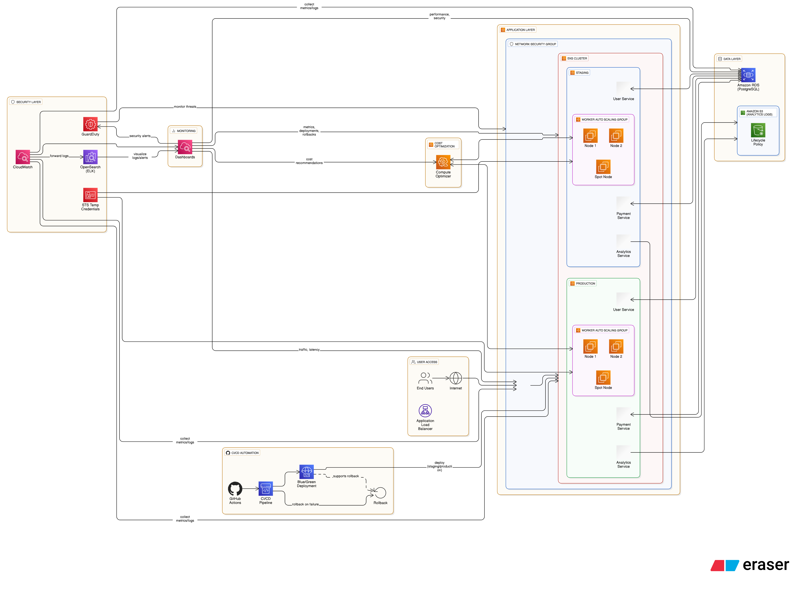

# 🌩️ Cloud Case Study: Scaling a FinTech Startup with AWS & DevOps Automation
Scaling a FinTech startup with AWS EKS, CI/CD, cost optimization, and DevSecOps.

---

##  Client Background
A fast-growing **FinTech startup** providing real-time payment analytics was struggling with scalability and reliability.  
Their platform had grown from **5K → 50K+ users in under 6 months**, and the monolithic architecture was reaching breaking point.

---

## ⚠️ Challenges
1. **Downtime & Performance Issues**  
   - Hosted on a single AWS EC2 instance.  
   - Frequent crashes during peak traffic (e.g., salary processing at month-end).  

2. **Manual Deployments**  
   - Code pushed manually via SSH.  
   - Slow, error-prone, no rollback process.  

3. **Rising Costs**  
   - Overprovisioned EC2s due to lack of autoscaling.  
   - No visibility into unused resources.  

4. **Security Gaps**  
   - Long-term IAM keys hardcoded in application code.  
   - No centralized monitoring for security events.  

---

## ✅ CloudieHub Solution

### 🏗️ Infrastructure Modernization
- Migrated **monolith → microservices** running on **Amazon EKS (Kubernetes)**  
- Introduced **AWS ALB (Application Load Balancer)** for smart routing  
- Configured **Auto Scaling Groups** to handle demand spikes  

### 🔄 CI/CD Automation
- Set up **GitHub Actions** pipelines with:  
  - Automated builds & tests  
  - **Blue/Green deployments** for zero downtime  
  - Rollback-on-failure mechanism  

### 💰 Cost Optimization
- Shifted workloads to **EC2 Spot Instances** for non-critical services  
- Used **AWS Compute Optimizer** to right-size instances  
- Adopted **S3 Lifecycle Policies** → archived old logs, cutting storage costs by **40%**  

### 🔒 Security Enhancements
- Eliminated long-term IAM keys → replaced with **STS temporary credentials**  
- Integrated **AWS GuardDuty** for continuous threat detection  
- Centralized logging with **CloudWatch + OpenSearch (ELK)** for visibility  

---

## 📊 Results

| Metric            | Before CloudieHub   | After CloudieHub       |
|-------------------|---------------------|------------------------|
| **Monthly Downtime** | ~20 hours           | **< 15 minutes**       |
| **Deployment Speed** | 3–4 hours (manual)  | **~10 minutes**        |
| **Cloud Costs**      | $15,000/month       | **$9,500/month (−37%)** |
| **Security Risks**   | High (hardcoded keys) | **Minimal** (STS + monitoring) |

---

## 🏆 Business Impact
- Reliable **month-end salary processing** with no outages  
- **Deployment time cut by 95%**, enabling faster innovation  
- Saved **$5,500/month**, reallocated to product growth  
- Stronger **security posture & audit readiness**  

---

### 🔗 About CloudieHub
We design scalable, secure Cloud & DevOps platforms across **AWS, Azure, GCP, and Alibaba Cloud**.  

📌 **Website:** [cloudiehub.com](https://cloudiehub.com)  
✉️ **Email:** hello@cloudiehub.com  

